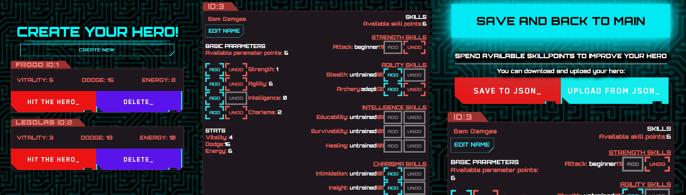
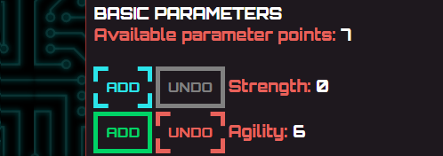
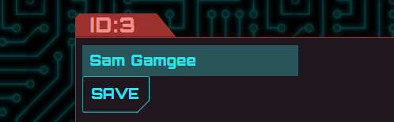
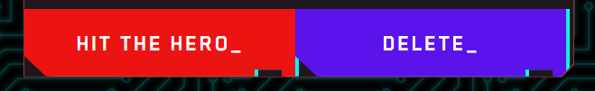

# 🤖 Create and customize your hero 🤖

## About

Application for creating and customizing characters

## ScreenShot

## Demo

You can try it with GitHub-Pages
[here](https://foxcaulfield.github.io/create-your-hero/)

## Technologies, libraries & services

Built with:

- react
- redux
- react-redux
- react-router
- gh-pages

## How to use

- Press "Create new" on main page to create
  

- Add or detract available points by clicking "Add" and "Undo" buttons
  

- Edit name as desired, after you finished, click "Save"
  

- You can also save your hero to JSON file and upload it later 😎 Just use "Save
  to JSON" and "Upload from JSON" buttons  
  

- After you finished creating the hero, click "Save and back to main" button
  

- You can hit or delete your hero just pressing proper buttons
  

Happy hacking!🐱‍👤
